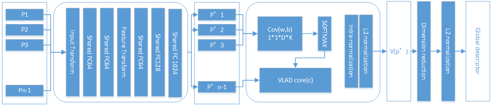

#  3D Point cloud based Place retrieval by Supervised learning



## Introduction
The algorithm is a deep network that addresses the problem of large-scale place recognition through point cloud based retrieval.  
## Benchmark Datasets
The benchmark datasets introdruced in this work can be downloaded [here](https://drive.google.com/open?id=1Wn1Lvvk0oAkwOUwR0R6apbrekdXAUg7D).
* All submaps are in binary file format
* Ground truth GPS coordinate of the submaps are found in the corresponding csv files for each run
* Filename of the submaps are their timestamps which is consistent with the timestamps in the csv files
* Use CSV files to define positive and negative point clouds
* All submaps are preprocessed with the road removed and downsampled to 4096 points

### Oxford Dataset
* 45 sets in total of full and partial runs
* Used both full and partial runs for training but only used full runs for testing/inference
* Training submaps are found in the folder "pointcloud_20m_10overlap/" and its corresponding csv file is "pointcloud_locations_20m_10overlap.csv"
* Training submaps are not mutually disjoint per run
* Each training submap ~20m of car trajectory and subsequent submaps are ~10m apart
* Test/Inference submaps found in the folder "pointcloud_20m/" and its corresponding csv file is "pointcloud_locations_20m.csv"
* Test/Inference submaps are mutually disjoint


## Project Code

### Pre-requisites
#### Hardware
* Intel CPU:E5 generation
* GPU: GTX 2080 Ti
* Memories: 32GB or above
#### Software
* Python3.6
* CUDA10.1
* Tensorflow 
* Scipy
* Pandas
* Sklearn
* Sklearn
* Pytorch-Lighting
* Numpy

Code was tested using Python 3 on Tensorflow 2.21.0 with CUDA 11.0

```
sudo apt-get install python3-pip python3-dev python-virtualenv
virtualenv --system-site-packages -p python3 ~/tensorflow
source ~/tensorflow/bin/activate
easy_install -U pip
pip3 install --upgrade tensorflow-gpu==2.21.0
pip install scipy, pandas, sklearn
```
### Dataset set-up
Download the zip file of the benchmark datasets found [here](https://drive.google.com/open?id=1rflmyfZ1v9cGGH0RL4qXRrKhg-8A-U9q). Extract the folder on the same directory as the project code. Thus, on that directory you must have two folders: 1) benchmark_datasets/ and 2) pointnetvlad/

### Generate pickle files
We store the positive and negative point clouds to each anchor on pickle files that are used in our training and evaluation codes. The files only need to be generated once. The generation of these files may take a few minutes.

```
cd generating_queries/ 

# For training tuples in our baseline network
python generate_training_tuples_baseline.py

# For training tuples in our refined network
python generate_training_tuples_refine.py

# For network evaluation
python generate_test_sets.py
```

### Model Training and Evaluation
To train our network, run the following command:
```
python train_step.py
```
To evaluate the model, run the following command:
```
python train_step.py
```
### Visualize Point cloud bin file
To visualize point cloud bin file run the following command:
```
python read_bin_new.py
```
## Pre-trained Models
The pre-trained models for both the baseline and refined networks can be downloaded [here](https://drive.google.com/open?id=1wYsJmfd2yfbK9DHjFHwEeU1a_x35od61)

## Submap generation
Added the rough MATLAB code that was used for submap generation upon requests. Some functions are gotten from the toolbox of [Oxford Robotcar](https://robotcar-dataset.robots.ox.ac.uk/).

